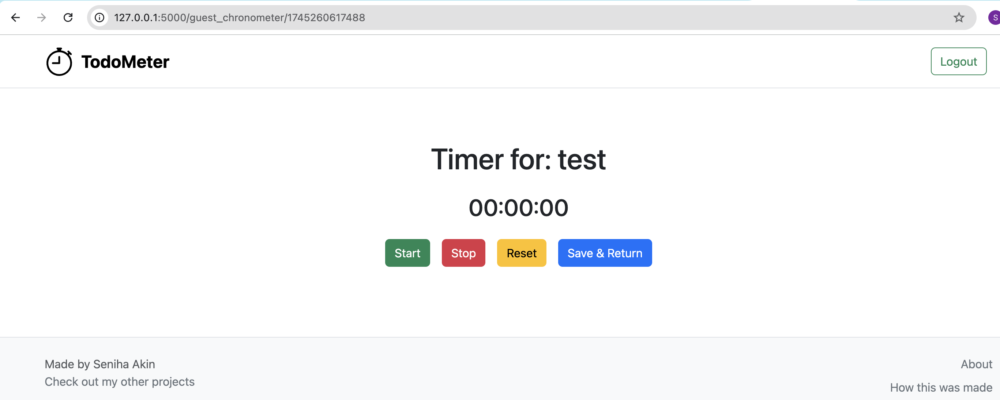

# Todo Chronometer 🕰️

A simple Flask web application that allows users to manage their todos and track the time spent on each task using a built-in chronometer.

## ✨ Features

- Add, edit, and delete todo tasks.
- Track time spent on each task with a chronometer.
- Organize todos in a user-friendly interface.
- Persistent storage using SQLite database.

## 🛠 Tech Stack

- Python
- Flask
- Flask-WTF (Forms)
- Flask-SQLAlchemy (Database ORM)
- SQLite (Local database)
- Bootstrap (For styling)

## 🚀 Installation

1. **Clone the repository:**

```bash
git clone https://github.com/your-username/your-repo-name.git
cd your-repo-name
```

2. **Create a virtual environment:**

```bash
python -m venv env
source env/bin/activate    # On MacOS/Linux
env\Scripts\activate       # On Windows
```

3. **Install dependencies:**

```bash
pip install -r requirements.txt
```

4. **Set environment variables:**

Create a `.flaskenv` file in the root directory and add:

```
FLASK_APP=todochronometer.py
FLASK_ENV=development
SECRET_KEY=your-secret-key
```

5. **Run the application:**

```bash
flask run
```

Then visit [http://localhost:5000](http://localhost:5000) in your browser.

## ⚙️ Environment Variables

| Variable | Purpose |
|:---|:---|
| `SECRET_KEY` | A secret key for Flask sessions |
| `DATABASE_URL` | (Optional) URL to a production database |

## 📦 Deployment


**To deploy:**
- Create a `requirements.txt` and `Procfile`
- Push to GitHub
- Connect to your hosting platform
- Set environment variables
- Deploy!

## 📸 Screenshots

```markdown



```

## 🔮 Future Improvements

- Save Todolist as a pdf

## 📝 License

This project is open-source under the [MIT License](LICENSE).
Please note: while the code is open-source, copying the deployed website exactly without permission is discouraged.


